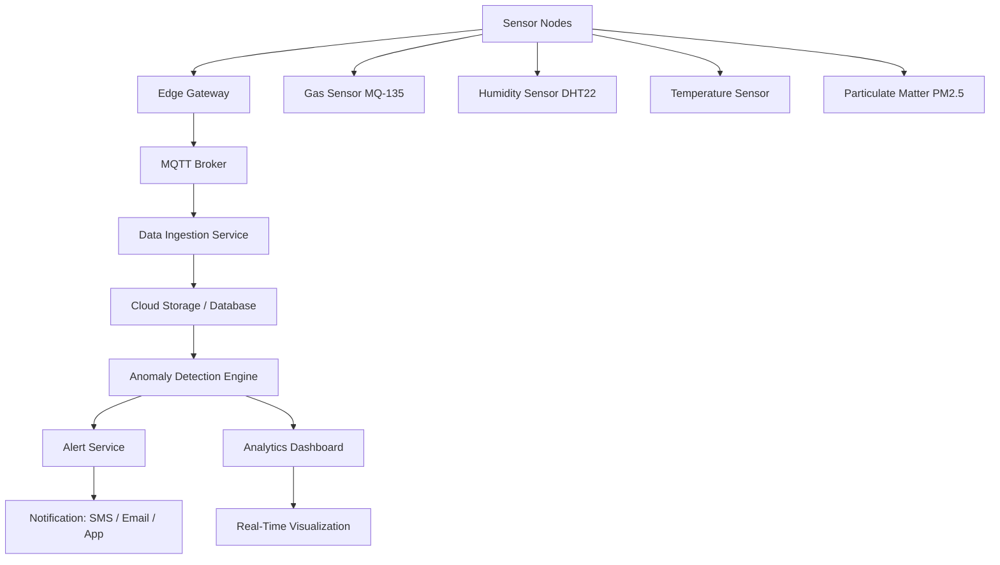
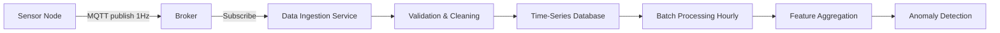
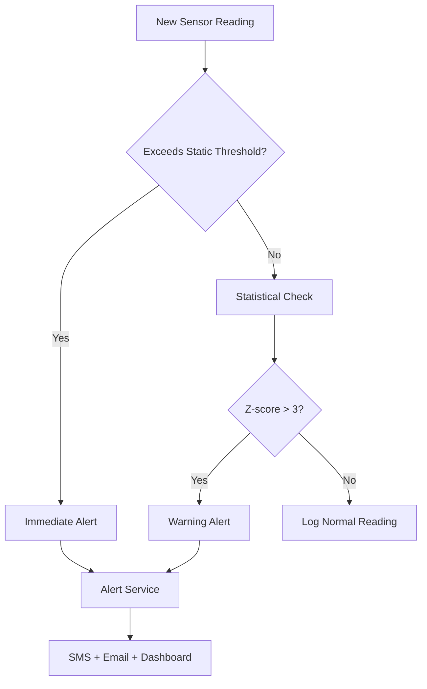
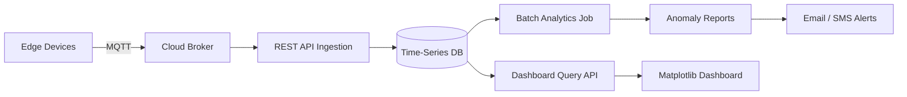

# 🏙️ Public Sanitation Monitoring — IIoT Sensor Network with Anomaly Detection

[](https://python.org)
[]()
[]()
[](LICENSE)

> An Industrial IoT (IIoT) system for continuous environmental monitoring in public sanitation infrastructure. Sensor data is collected, processed, and analyzed in real-time using threshold-based anomaly detection algorithms to automatically flag hygiene violations.

---

## 📋 Table of Contents

- [Overview](#overview)
- [IIoT Architecture](#iiot-architecture)
- [Sensor Integration](#sensor-integration)
- [Data Collection](#data-collection)
- [Anomaly Detection](#anomaly-detection)
- [Cloud Workflow](#cloud-workflow)
- [Dashboard Analytics](#dashboard-analytics)
- [Project Structure](#project-structure)
- [Setup & Installation](#setup--installation)
- [Future Scope](#future-scope)
- [Roadmap](#roadmap)
- [Technologies Used](#technologies-used)

---

## 🔍 Overview

Public sanitation infrastructure often lacks real-time monitoring, leading to delayed response to hygiene violations. This system deploys a network of low-cost environmental sensors connected via IIoT protocols to provide continuous, automated monitoring with intelligent alerting.

**Core Capabilities:**
- Continuous environmental data collection from sensor network
- Threshold-based anomaly detection for hygiene violations
- Automated alert generation when violations are detected
- Real-time dashboard for sanitation authorities
- Historical data analytics and trend visualization

---

## 🏗️ IIoT Architecture



### Architecture Layers

| Layer | Components | Role |
|-------|-----------|------|
| **Perception** | Gas, humidity, temperature, PM sensors | Environmental data acquisition |
| **Network** | MQTT, Wi-Fi, cellular | Data transmission |
| **Processing** | Python data pipeline | Cleaning, feature extraction |
| **Intelligence** | Anomaly detection algorithms | Violation identification |
| **Application** | Dashboard, alerts | Operator interface |

---

## 🔌 Sensor Integration

### Sensor Array

| Sensor | Parameter | Unit | Threshold Example |
|--------|-----------|------|-------------------|
| MQ-135 Gas Sensor | NH₃, H₂S, CO₂ | ppm | >50 ppm NH₃ → Alert |
| DHT22 | Temperature | °C | >35°C in enclosed space |
| DHT22 | Relative Humidity | % RH | >90% RH → Alert |
| PMS5003 | PM2.5 Particulate | µg/m³ | >35 µg/m³ → Alert |

### Communication Protocol

```
Sensor Node → MQTT Publish → Topic: sanitation/{location_id}/sensors
Payload: {
  "timestamp": "2025-01-15T10:30:00Z",
  "location_id": "block_A_toilet_1",
  "nh3_ppm": 12.4,
  "h2s_ppm": 0.8,
  "temperature_c": 28.3,
  "humidity_pct": 76.2,
  "pm25_ugm3": 18.5
}
```

---

## 📡 Data Collection



**Collection Parameters:**
- Sampling rate: 1 Hz (1 reading per second per sensor)
- Aggregation: 1-minute rolling windows for anomaly checks
- Storage: Timestamped CSV / time-series database
- Transmission: MQTT over Wi-Fi (ESP32 modules)

---

## 🚨 Anomaly Detection

The anomaly detection engine applies a multi-level approach:

### Level 1: Static Threshold Detection
```python
# Example thresholds (configurable per location)
THRESHOLDS = {
    "nh3_ppm":       {"warning": 25,  "critical": 50},
    "h2s_ppm":       {"warning": 1.0, "critical": 5.0},
    "humidity_pct":  {"warning": 85,  "critical": 95},
    "pm25_ugm3":     {"warning": 25,  "critical": 75},
}
```

### Level 2: Statistical Anomaly Detection
- **Z-score method**: Readings > 3σ from rolling mean flagged as anomalies
- **Rolling window**: 15-minute sliding window for baseline computation
- **Trend detection**: Monotonic increase over 10+ readings triggers early alert



---

## ☁️ Cloud Workflow



**Cloud Integration:**
- Automated data ingestion via REST APIs
- Scheduled batch analytics (hourly/daily reports)
- Persistent storage for historical trend analysis
- Cloud-based alerting service for real-time notifications

---

## 📊 Dashboard Analytics

The Matplotlib-based dashboard provides:

- **Real-time time-series plots** for all sensor channels
- **Anomaly markers** overlaid on sensor plots
- **Heatmap view** — location-level hygiene status at a glance
- **Historical trend charts** — daily/weekly aggregates
- **Alert log** — timestamped violation history
- **Location comparison** — cross-facility sensor benchmarking

---

## 📁 Project Structure

```
Public-Sanitation-Monitoring/
├── README.md
├── requirements.txt
├── sensor/
│   └── data_collector.py         # Sensor data ingestion & MQTT client
├── dashboard/
│   └── visualize.py              # Real-time dashboard with Matplotlib
├── docs/
│   └── architecture.md           # Detailed system documentation
└── architecture/
    └── system_diagram.md         # Architecture diagram reference
```

---

## 🚀 Setup & Installation

```bash
git clone https://github.com/umeshpandeysh/Public-Sanitation-Monitoring.git
cd Public-Sanitation-Monitoring

python -m venv venv
venv\Scripts\activate
pip install -r requirements.txt

# Start data collector (requires MQTT broker)
python sensor/data_collector.py

# Launch dashboard
python dashboard/visualize.py
```

---

## 🔭 Future Scope

- [ ] Replace threshold detection with ML-based anomaly detection (Isolation Forest, Autoencoder)
- [ ] Deploy LSTM model for predictive maintenance and early violation warning
- [ ] Build mobile app for sanitation authority field workers
- [ ] Integrate with municipal GIS systems for location-aware monitoring
- [ ] Add computer vision module for visual cleanliness assessment
- [ ] Federated learning across multiple facilities

---

## 🗺️ Roadmap

| Phase | Status | Description |
|-------|--------|-------------|
| Phase 1: Sensor Network | ✅ Complete | Hardware setup, MQTT integration, data collection |
| Phase 2: Anomaly Detection | ✅ Complete | Threshold + statistical anomaly algorithms |
| Phase 3: Dashboard | ✅ Complete | Real-time Matplotlib visualization |
| Phase 4: Cloud Integration | ✅ Complete | REST API pipelines, automated alerts |
| Phase 5: ML Detection | 🔄 In Progress | Isolation Forest / Autoencoder replacement |
| Phase 6: Mobile App | 📋 Planned | Field worker mobile interface |

---

## 🛠️ Technologies Used

| Category | Tools |
|----------|-------|
| **Language** | Python 3.10+ |
| **IIoT** | MQTT (paho-mqtt), ESP32, sensors |
| **Data** | Pandas, NumPy |
| **Visualization** | Matplotlib, Seaborn |
| **API** | REST APIs, Flask |
| **Anomaly Detection** | Statistical methods, Z-score, thresholds |

---

## 📄 License

MIT License — see [LICENSE](LICENSE) for details.

---

<div align="center">

**Public Sanitation Monitoring** | Built by [Umesh Pandey](https://github.com/umeshpandeysh)

</div>
